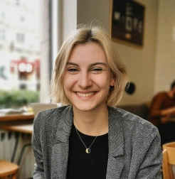

## About Me

Hi! I am a Ph.D. candidate in Computer Science at Stanford, studying machine learning methods used for decision support.

I collaborate with [Panoptykon Foundation](https://en.panoptykon.org) with the goal of combating AI hype and supporting EU policymakers in regulating automated decision systems that impact humans.

Before joining Stanford, I completed a B.S.E. in Computer Science at Princeton University with a minor in Statistics and Machine Learning, where I did research with [Barbara Engelhardt](http://beehive.cs.princeton.edu/) and [Sebastian Seung](http://seunglab.org/).

## Publications

**Zero-Shot Transfer Learning with Synthesized Data for Multi-Domain Dialogue State Tracking**

Giovanni Campagna, Agata Foryciarz, Mehrad Moradshahi, Monica S. Lam.

ACL 2020.

[[pdf](https://almond-static.stanford.edu/papers/multiwoz-acl2020.pdf)]

**From Theory to Practice: Where do Algorithmic Accountability and Explainability Frameworks Take Us in the Real World**

Katarzyna Szymielewicz, Anna Bacciarelli, Fanny Hidvegi, Agata Foryciarz, Soizic Pénicaud, Matthias Spielkamp.

CRAFT Session at the ACM Fairness, Accountability and Transparency (FAT*) Conference 2020. Barcelona.

[[abstract](https://dl.acm.org/doi/abs/10.1145/3351095.3375683), [website](https://algorithmwatch.org/en/fat-2020-craft-session-from-theory-to-practice/)]

**Mitochondrial Size Gradients in Cortical Neurons Suggested by 3D Electron Microscopy**

Nicholas L. Turner, Runzhe Yang, Agata Foryciarz, Kisuk Lee, William Silversmith, William Wong, Jingpeng Wu, Sven Dorkenwald, T. L. Lewis, Yusuke Hirabayashi, Franck Polleux, Nuno da Costa, R. Clay Reid, H. Sebastian Seung.

Society for Neuroscience Conference 2018. November 2018. San Diego, CA, USA.

**Identification of allele-specific expression quantitative trait loci using a Poisson generalized linear model**

Agata Foryciarz, Genna Gliner, YoSon Park, Barbara E Engelhardt.

Women in Machine Learning Workshop at NeurIPS 2017.

## Other

Black-Boxed Politics: Opacity is a Choice in AI Systems
Agata Foryciarz, Daniel Leufer, Katarzyna Szymielewicz
Medium, January 2020
[[link](https://medium.com/@szymielewicz/black-boxed-politics-cebc0d5a54ad)]

Chi controlla l’intelligenza artificiale 
Agata Foryciarz, Daniel Leufer, Katarzyna Szymielewicz
Translation for Internazionale 1346, February 2020
[[pdf](http://www.dmi.unict.it/~ggiuffrida/Internazionale1346.pdf)]

Czy sztuczna inteligencja może być obiektywna?
Agata Foryciarz, Jan Stradowski
Podcast w Radio Tok FM
[[link](https://audycje.tokfm.pl/podcast/76088,Czy-sztuczna-inteligencja-moze-byc-obiektywna)]

## Nauka za granicą

During college, I was a US pro-bono college admissions mentor at Project Access, which works to provide access to education at world’s top universities to students coming from underrepresented countries and backgrounds. If you want to become a mentee or a mentor, sign up [here](https://projectaccess.org/).

Jeśli jesteś uczniem i zastanawiasz się nad wyjazdem za granicę na liceum bądź studia,  odwiedź zakładkę [nauka za granicą]().

